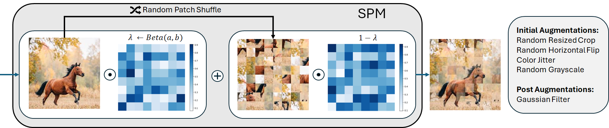
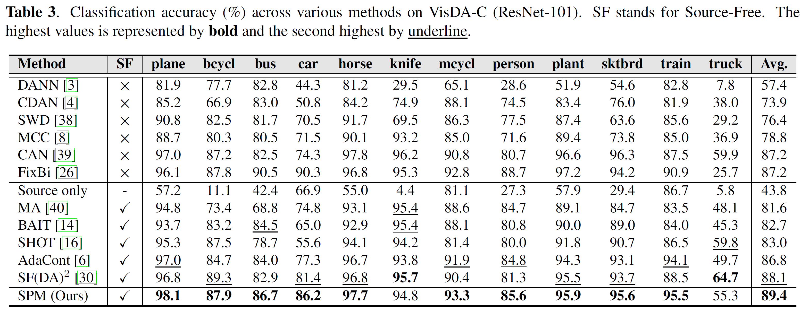
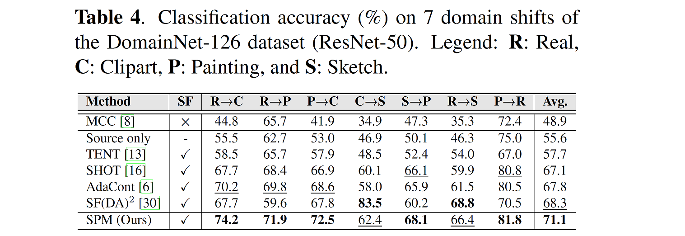

# <p align="center">Shuffle PatchMix</p>

<p align="center">
  <a href="https://arxiv.org/abs/2504.13077"></a>
  <a href="https://paperswithcode.com/paper/effective-dual-region-augmentation-for"></a>
  <a href="LICENSE"></a>
</p>


This is the official implementation of the ICIP 2025 paper **"Shuffle PatchMix Augmentation with Confidence Margin Weighted Pseudo-Labels for Enhanced Source-Free Domain Adaptation"**, by [Prasanna Reddy Pulakurthi](https://www.prasannapulakurthi.com/), [Majid Rabbani](https://www.rit.edu/directory/mxreee-majid-rabbani), [Jamison Heard](https://www.rit.edu/directory/jrheee-jamison-heard), [Sohail A. Dianat](https://www.rit.edu/directory/sadeee-sohail-dianat), [Celso M. de Melo](https://celsodemelo.net/), and [Raghuveer Rao](https://ieeexplore.ieee.org/author/37281258600).




## Installation

Clone this repository.

  ~~~
  git clone https://github.com/PrasannaPulakurthi/SPM.git
  cd SPM
  ~~~
    
The code is tested with [Pytorch](https://pytorch.org/get-started/locally/) 1.7.1, CUDA 11.0. Please also make sure to install the following packages:

  ~~~
  pip install hydra-core numpy omegaconf sklearn tqdm wandb seaborn
  ~~~

## VisDA-C

### **Prepare dataset**

Please download the [VisDA-C dataset](https://github.com/VisionLearningGroup/taskcv-2017-public/tree/master/classification), and put it under `${DATA_ROOT}`. For your convenience, the `.txt` files based on the image labels are provided under `./datasets/VISDA-C/`. The prepared directory would look like this:

```bash
${DATA_ROOT}
├── VISDA-C
│   ├── train
│   ├── validation
│   ├── train_list.txt
│   ├── validation_list.txt
```

`${DATA_ROOT}` is set to `./datasets/` by default, which can be modified in `configs/data/basic.yaml` or via hydra command line interface `data.data_root=${DATA_ROOT}`.

### **Training**
The [hydra](https://github.com/facebookresearch/hydra) is used as the configuration system. By default, the working directory is `./output`, which can be changed directly from `configs/root.yaml` or via hydra command line interface `workdir=${WORK_DIR}`.

VISDA-C experiments are done for `train` to `validation` adaptation. Before the adaptation, we should have the source model. You may train the source model with script `scripts/train_VISDA-C_source.sh` as shown below. The pre-trained source models for seed 2022 can be [downloaded from here](https://drive.google.com/drive/folders/1i_orPbG753tJ220oLLKi4hAgSudBCLOC?usp=sharing).

After obtaining the source models, put them under `${SRC_MODEL_DIR}` and run `scripts/train_VISDA-C_target.sh` to execute the adaptation.

```bash
export CUDA_VISIBLE_DEVICES=0,1,2,3

# train source model
bash scripts/train_VISDA-C_source.sh

# train SPM SFDA
bash scripts/train_VISDA-C_target.sh <SRC_MODEL_DIR>
# example: bash scripts/train_VISDA-C_target.sh "output/VISDA-C/source" 
```

This will reproduce Table. 3 from the main paper:



For Windows users, the commands can be found in `scripts_win/`.

## DomainNet-126

### **Prepare dataset**

Please download the [DomainNet dataset (cleaned version)](http://ai.bu.edu/M3SDA/), and put it under `${DATA_ROOT}`. Notice that we follow [MME](https://arxiv.org/abs/1904.06487) to use a subset that contains 126 classes from 4 domains. The `.txt` files on the image labels, are provided under `./datasets/domainnet-126/`. The prepared directory would look like this:

```bash
${DATA_ROOT}
├── domainnet-126
│   ├── real
│   ├── sketch
│   ├── clipart
│   ├── painting
│   ├── real_list.txt
│   ├── sketch_list.txt
│   ├── clipart_list.txt
│   ├── painting_list.txt
```

`${DATA_ROOT}` is set to `./datasets/` by default, which can be modified in `configs/data/basic.yaml` or via hydra command line interface `data.data_root=${DATA_ROOT}`.

### **Training**
The [hydra](https://github.com/facebookresearch/hydra) is used as the configuration system. By default, the working directory is `./output`, which can be changed directly from `configs/root.yaml` or via hydra command line interface `workdir=${WORK_DIR}`.

DomainNet-126 experiments are done for 7 domain shifts constructed from combinations of `Real`, `Sketch`, `Clipart`, and `Painting`. Before the adaptation, we should have the source model. You may train the source model with script `scripts/train_domainnet-126_source.sh` as shown below. The pre-trained source models for seed 2022 can be [downloaded from here](https://drive.google.com/drive/folders/1i_orPbG753tJ220oLLKi4hAgSudBCLOC?usp=sharing).

After obtaining the source models, put them under `${SRC_MODEL_DIR}` and run `scripts/train_domainnet-126_target.sh` to execute the adaptation.

```bash
export CUDA_VISIBLE_DEVICES=0,1,2,3

# train source model
bash scripts/train_domainnet-126_source.sh <SOURCE_DOMAIN>
# example: bash scripts/train_domainnet-126_source.sh real

# train SPM SFDA
bash scripts/train_domainnet-126_target.sh <SOURCE_DOMAIN> <TARGET_DOMAIN> <SRC_MODEL_DIR>
# example: bash scripts/train_domainnet-126_target.sh real sketch "output/domainnet-126/source"
```

This will reproduce Table. 4 from the main paper:



For Windows users, the commands can be found in `scripts_win/`.

## PACS

### **Prepare dataset**
Download PACS from [kaggel](https://www.kaggle.com/datasets/nickfratto/pacs-dataset/data?select=pacs_data).

## Reference

If you find this work helpful to your work, please consider citing us:
```
```

## Acknowledgement
Codebases from [AdaContrast](https://github.com/DianCh/AdaContrast) and [FBA](https://github.com/PrasannaPulakurthi/Foreground-Background-Augmentation).
